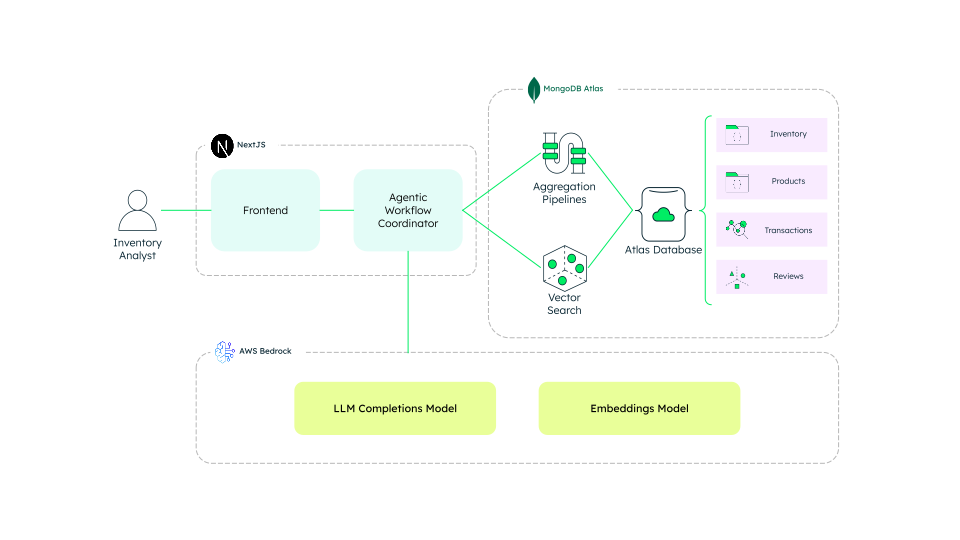

# GenAI Inventory Optimization

This project showcases how **Generative AI** and **MongoDB Atlas Vector Search** can enhance inventory classification by unlocking insights from unstructured data.

In traditional ABC analysis, classification is based only on annual dollar usage. But what about factors like customer satisfaction or product reliability—often buried in reviews, forums, and service notes? This solution brings those hidden insights into the spotlight.

By combining **structured** and **unstructured data**, and using **multi-criteria inventory classification (MCIC)**, this solution helps teams make smarter, future-facing decisions.

---

## What This Demo Does

- Runs a traditional ABC analysis
- Adds extra criteria like lead time or unit cost
- Uses GenAI to **generate new criteria** from unstructured sources like product reviews
- Classifies inventory with all selected criteria, using **weighted scoring**
- Lets you explore the data powering the results

---

## Tech Stack

- **Frontend & Workflows:** Next.js
- **Database & Vector Search:** MongoDB Atlas
- **LLM & Embeddings:** AWS Bedrock (Claude & Cohere)



---

## MongoDB Features in Action

- **Atlas Vector Search**: Search and score unstructured data like reviews using semantic similarity.
- **Unified Data Layer**: Combine operational data, criteria definitions, and embeddings in one place.
- **Time Series Collections**: Analyze performance trends over time.
- **Analytics Nodes**: Run workloads at scale without impacting production data.

> [!NOTE]
> Learn more about [MongoDB Atlas](https://www.mongodb.com/atlas/database).

## Prerequisites

Before running locally, make sure you have:

- A **MongoDB Atlas cluster**
- **AWS CLI installed** and a profile with access to AWS Bedrock services
- **AWS SSO authenticated** (recommended for secure CLI sessions)
- **Node.js v14 or higher**

---

## Environment Setup

Create a file named `.env.local` in the `app/` folder with the following content:

```env
MONGODB_URI="<your-mongodb-connection-string>" # MongoDB Atlas connection string
DATABASE_NAME="genai_inventory_classification" # Name of the database for this app
COMPLETION_MODEL_ID="us.anthropic.claude-haiku-4-5-20251001-v1:0" # LLM used for criteria generation
EMBEDDING_MODEL_ID="cohere.embed-english-v3" # Embedding model used for vector generation
AWS_REGION="us-east-1" # AWS Region for Bedrock services
```

> [!TIP]
> Make sure your AWS CLI is configured and authenticated before starting the app. We recommend running `aws sso login` if using AWS SSO.

---

## How to Run It Locally

1. Open a terminal and go to the `app` folder:

   ```sh
   cd app
   ```

2. Install the dependencies:

   ```sh
   npm install
   ```

3. Start the development server:

   ```sh
   npm run dev
   ```

4. Visit [http://localhost:3000](http://localhost:3000) in your browser to use the app.

---

## Common Issues

- ❌ **App doesn't start?**  
  Make sure your `.env.local` file is in place with valid credentials.

- ❌ **AWS Bedrock errors?**  
  Ensure your AWS CLI is authenticated and has permission to access Bedrock models.

---
